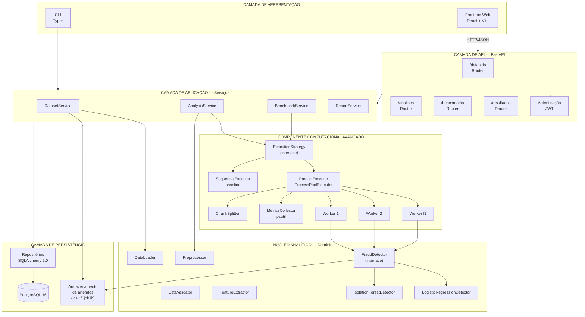
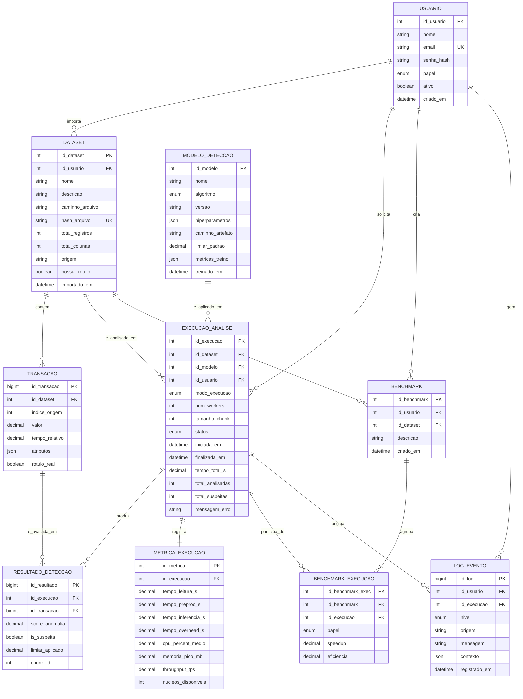
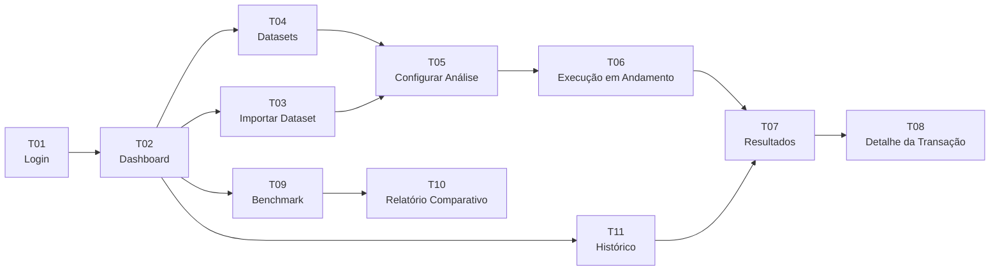

# SISTEMA INTELIGENTE DE DETECÇÃO DE FRAUDES EM TRANSAÇÕES
## Documento Técnico — Sprint 02
### Arquitetura, Modelagem de Dados e Prototipação

**Curso:** Ciência da Computação — **Turma:** 8MB — **Instituição:** UNINASSAU
**Disciplinas:** Fábrica de Software / Tópicos Avançados em Ciência da Computação
**Professores:** Pryscilla de Barros Gonçalves; Antenor Jorge Parnaiba da Silva

**Equipe:** Bruno Severino de Almeida Rocha; Rodrigo Amorim Neves; Everson Padilha Ferreira

**Repositório:** https://github.com/MysticXiz/transaction-fraud-detector

---

## 0. Continuidade em Relação à Sprint 01

A Sprint 01 definiu o problema, os objetivos, os requisitos funcionais (RF01–RF11), os requisitos não funcionais, os casos de uso (UC01–UC07) e o Product Backlog (PB01–PB20). Diversos itens tecnológicos permaneceram registrados como **"A DEFINIR"**.

O objetivo desta Sprint 02 é **fechar essas definições** e traduzir os requisitos já aprovados em artefatos de engenharia: arquitetura, diagrama de classes, modelo conceitual (MER), modelo relacional, protótipo de telas e banco de dados implementado.

### 0.1 Consolidação das decisões pendentes

| Item | Status Sprint 01 | Decisão Sprint 02 | Justificativa técnica |
|---|---|---|---|
| Framework web | FastAPI / Flask / equiv. | **FastAPI 0.115+** | Geração automática de OpenAPI/Swagger, validação declarativa via Pydantic e suporte nativo a execução em segundo plano (`BackgroundTasks`), necessário porque uma análise sobre centenas de milhares de registros não pode bloquear a requisição HTTP. |
| Biblioteca de dados | Pandas / NumPy / Polars / Dask | **Pandas 2.x + NumPy** | Decisão crítica para a validade do experimento. Polars e Dask paralelizam internamente por padrão; adotá-los tornaria impossível estabelecer um *baseline* sequencial honesto, invalidando as métricas de *speedup* exigidas pelo RF09. Pandas é predominantemente single-thread, garantindo que o ganho medido decorra exclusivamente da paralelização implementada pela equipe. |
| Modelo de IA | Isolation Forest / XGBoost / Autoencoder / Reg. Logística | **Isolation Forest (principal) + Regressão Logística (comparativo)** | O Isolation Forest é não supervisionado, robusto a desbalanceamento extremo de classes e, sobretudo, sua fase de inferência é *embarrassingly parallel*: cada bloco de transações pode ser pontuado de forma totalmente independente, sem comunicação entre processos. Isso o torna o algoritmo ideal para evidenciar o ganho da arquitetura paralela. A Regressão Logística atua como referência supervisionada para avaliação de qualidade da classificação. |
| Base de dados de entrada | Pública/sintética | **Credit Card Fraud Detection (ULB — Université Libre de Bruxelles)** | 284.807 transações, 492 fraudes (0,172%), atributos já anonimizados por PCA (V1–V28). Atende integralmente ao RNF de Segurança definido na Sprint 01, pois não contém nenhum dado pessoal identificável. Volume suficiente para tornar a carga *CPU-bound*. |
| Paralelização | multiprocessing / concurrent.futures | **`concurrent.futures.ProcessPoolExecutor`** | API de mais alto nível, com propagação estruturada de exceções (atende ao RNF de Confiabilidade) e suporte a `initializer`, que permite carregar o modelo **uma única vez por worker**, evitando a re-serialização do estimador a cada bloco — principal causa de anulação do ganho de desempenho. |
| Banco de dados | A DEFINIR | **PostgreSQL 16** (via Docker Compose) + **SQLAlchemy 2.0** + **Alembic** | Necessário suporte a tipos `JSONB` (atributos variáveis de transação) e `ENUM` nativos, ausentes ou limitados no SQLite. Alembic garante versionamento do esquema, coerente com o RNF de Manutenibilidade. |
| Frontend | Opcional | **Protótipo Figma nesta Sprint; React 18 + Vite + Tailwind na Sprint 03** | Mantém a camada de apresentação como cliente exclusivo da API, conforme já previsto na Sprint 01. |

---

## 1. Arquitetura do Sistema

### 1.1 Estilo arquitetural adotado

O sistema adota uma **arquitetura em camadas sobre um monólito modular**, complementada por um **componente de execução paralela** isolado no núcleo de domínio.

A opção pelo monólito modular — e não por microsserviços — é deliberada. O projeto possui um único fluxo de negócio coeso (importar → pré-processar → detectar → reportar), e a introdução de fronteiras de rede entre módulos adicionaria latência e overhead de serialização que **poluiriam justamente a medição de desempenho** que constitui o objeto central de estudo da disciplina de Tópicos Avançados. A modularização é obtida por separação de pacotes e inversão de dependência, não por separação de processos de serviço.

### 1.2 Camadas

| Camada | Responsabilidade | Tecnologia |
|---|---|---|
| **Apresentação** | Interface do analista; consome exclusivamente a API REST. Não contém regra de negócio. | React + Vite (Sprint 03) / CLI (Typer) |
| **API / Interface** | Exposição de endpoints HTTP, serialização, validação de contrato, autenticação. | FastAPI + Pydantic v2 |
| **Aplicação (Serviços)** | Orquestração dos casos de uso. Coordena importação, disparo de análises, benchmark e consulta de resultados. Não conhece HTTP nem SQL. | Python puro |
| **Domínio / Núcleo Analítico** | Regras de detecção, pré-processamento, particionamento e estratégias de execução. **Camada independente de framework.** | scikit-learn, Pandas, NumPy |
| **Componente Computacional Avançado** | Distribuição da carga entre múltiplos processos de CPU, coleta de métricas e cálculo de speedup/eficiência. | `concurrent.futures`, `os.cpu_count`, `psutil` |
| **Persistência** | Repositórios, mapeamento objeto-relacional e migrações. | SQLAlchemy 2.0, Alembic, PostgreSQL 16 |

O isolamento do Núcleo Analítico atende diretamente ao RNF de Manutenibilidade da Sprint 01 ("a lógica do motor analítico deverá permanecer independente da camada de apresentação"): o motor de detecção pode ser executado por script, por CLI ou pela API sem qualquer alteração de código.

### 1.3 Diagrama de arquitetura (C4 — Nível de Componentes)



### 1.4 Fluxo de execução de uma análise (RF04, RF05, RF06, RF08)

1. O analista envia o arquivo CSV via `POST /datasets` (UC01). O `DatasetService` calcula o hash SHA-256 do arquivo, grava o artefato em disco e persiste os metadados na tabela `dataset`.
2. O `DataValidator` verifica a presença e a tipagem das colunas mínimas obrigatórias (RF02). Inconsistências geram erro de contrato HTTP 422 sem interromper a aplicação (RNF de Confiabilidade).
3. O analista dispara `POST /analises` informando `dataset_id`, `modelo_id`, `modo_execucao` e `num_workers` (UC02, RF11). A API cria um registro em `execucao_analise` com status `PENDENTE`, retorna imediatamente `202 Accepted` e delega o processamento a uma `BackgroundTask`.
4. O `Preprocessor` executa limpeza, tratamento de nulos e normalização (`StandardScaler` sobre `Amount` e `Time`), produzindo uma matriz NumPy contígua (RF03).
5. O `ChunkSplitter` particiona a matriz em blocos independentes de tamanho configurável (UC03).
6. A `ExecutionStrategy` selecionada executa a inferência:
   - **`SequentialExecutor`**: itera os blocos em um único processo — constitui o *baseline* (PB09).
   - **`ParallelExecutor`**: submete os blocos a um `ProcessPoolExecutor`. Cada worker carrega o modelo uma única vez, no `initializer` (PB10).
7. Os escores retornados são reagregados **na ordem original dos índices**, garantindo o RNF de Paralelização ("a paralelização não deverá alterar o resultado final da classificação"). Essa equivalência será verificada por teste automatizado comparando os vetores de saída sequencial e paralelo.
8. O limiar de decisão é aplicado, as transações são rotuladas (RF06) e persistidas em `resultado_deteccao`.
9. O `MetricsCollector` grava tempo total, tempo por etapa, uso de CPU e memória em `metrica_execucao` (RF08, PB13).
10. O status da execução passa a `CONCLUIDA` e os resultados ficam disponíveis via `GET /analises/{id}/resultados` (UC05).

### 1.5 Integração com o componente computacional avançado

O componente avançado é o **pipeline de processamento paralelo em CPU**. Sua integração com o software ocorre pelo **padrão Strategy**: a camada de aplicação depende da abstração `ExecutionStrategy`, jamais de uma implementação concreta.

```python
resultado = self.execution_strategy.execute(matriz, detector)
```

Essa decisão traz três consequências práticas:

- **Comparabilidade (RF09):** trocar sequencial por paralelo é uma troca de objeto, o que garante que ambos os modos percorram exatamente o mesmo caminho de código, isolando a variável em estudo.
- **Extensibilidade:** uma futura estratégia baseada em `ThreadPoolExecutor` ou em GPU pode ser adicionada sem alterar os serviços.
- **Testabilidade:** o executor pode ser substituído por um *fake* nos testes unitários.

**Tratamento do overhead.** A proposta da Sprint 01 já registrava que a paralelização introduz custos de criação de processos, serialização e comunicação interprocessos. A arquitetura mitiga esses custos com três medidas concretas:

1. **Carga única do modelo por worker** via `initializer`, evitando serializar o estimador a cada bloco submetido.
2. **Blocos dimensionados para amortizar o custo de IPC** — o tamanho do bloco é parametrizável e será calibrado experimentalmente (a hipótese da equipe é que blocos pequenos demais tornarão o overhead dominante).
3. **Transferência de arrays NumPy contíguos**, e não de DataFrames, reduzindo o volume serializado pelo `pickle`.

As métricas formais avaliadas serão:

- **Speedup:** `S(n) = T_sequencial / T_paralelo(n)`
- **Eficiência:** `E(n) = S(n) / n`, onde `n` é o número de processos

Espera-se que a eficiência decresça com o aumento de `n`, conforme a Lei de Amdahl, uma vez que as fases de leitura e pré-processamento permanecem parcialmente seriais. A caracterização empírica dessa curva é um dos resultados esperados do projeto.

### 1.6 Estrutura de diretórios

```
transaction-fraud-detector/
├── docker-compose.yml
├── pyproject.toml
├── README.md
├── docs/
│   ├── sprint01-proposta.pdf
│   ├── sprint02-documento-tecnico.md
│   └── diagramas/
├── database/
│   ├── schema.sql
│   └── seeds.sql
├── src/
│   └── fraud_detector/
│       ├── api/            # routers, schemas Pydantic, dependências
│       ├── services/       # DatasetService, AnalysisService, BenchmarkService
│       ├── core/
│       │   ├── ingestion/  # DataLoader, DataValidator
│       │   ├── preprocessing/
│       │   ├── detection/  # FraudDetector e implementações
│       │   └── execution/  # ChunkSplitter, executores, MetricsCollector
│       ├── persistence/    # models ORM, repositórios, sessão
│       └── config/
├── migrations/             # Alembic
├── tests/
│   ├── unit/
│   └── integration/
└── notebooks/              # análise exploratória (PB07)
```

---

## 2. Diagrama de Classes

### 2.1 Decisões de projeto

O diagrama aplica três padrões, cada um respondendo a um requisito específico da Sprint 01:

- **Strategy em `FraudDetector`** — o RF04 admite "inteligência artificial, aprendizado de máquina ou detecção de anomalias". A abstração permite comparar Isolation Forest e Regressão Logística sem alterar o restante do sistema.
- **Strategy em `ExecutionStrategy`** — atende ao RF09 (comparação sequencial × paralelo) garantindo caminho de código idêntico.
- **Repository** — isola o acesso a dados, mantendo o núcleo analítico livre de dependência de SQLAlchemy.

### 2.2 Diagrama

```mermaid
classDiagram
    direction TB

    class Usuario {
        -int id
        -str nome
        -str email
        -str senhaHash
        -PapelUsuario papel
        -datetime criadoEm
        +autenticar(senha) bool
        +podeExecutarAnalise() bool
    }

    class Dataset {
        -int id
        -str nome
        -str descricao
        -str caminhoArquivo
        -str hashArquivo
        -int totalRegistros
        -int totalColunas
        -str origem
        -datetime importadoEm
        +validarEstrutura() ResultadoValidacao
        +obterAmostra(n) DataFrame
        +tamanhoEmMB() float
    }

    class Transacao {
        -int id
        -int indiceOrigem
        -float valor
        -float tempoRelativo
        -dict atributos
        -bool rotuloReal
        +paraVetor() ndarray
    }

    class ModeloDeteccao {
        -int id
        -str nome
        -TipoAlgoritmo algoritmo
        -str versao
        -dict hiperparametros
        -str caminhoArtefato
        -float limiarPadrao
        -datetime treinadoEm
        +carregarArtefato() object
        +estaTreinado() bool
    }

    class ExecucaoAnalise {
        -int id
        -ModoExecucao modo
        -int numWorkers
        -int tamanhoChunk
        -StatusExecucao status
        -datetime iniciadaEm
        -datetime finalizadaEm
        -float tempoTotalS
        -int totalAnalisadas
        -int totalSuspeitas
        -str mensagemErro
        +iniciar() void
        +concluir(resumo) void
        +falhar(erro) void
        +taxaSuspeicao() float
        +throughput() float
    }

    class ResultadoDeteccao {
        -int id
        -float scoreAnomalia
        -bool isSuspeita
        -float limiarAplicado
        -int chunkId
        +classificar(limiar) bool
    }

    class MetricaExecucao {
        -int id
        -float tempoLeituraS
        -float tempoPreprocS
        -float tempoInferenciaS
        -float tempoOverheadS
        -float cpuPercentMedio
        -float memoriaPicoMB
        -float throughputTps
        +percentualOverhead() float
    }

    class Benchmark {
        -int id
        -str descricao
        -datetime criadoEm
        +calcularSpeedup() float
        +calcularEficiencia() float
        +gerarRelatorio() RelatorioBenchmark
    }

    class BenchmarkExecucao {
        -int id
        -PapelBenchmark papel
        -float speedup
        -float eficiencia
    }

    class DataLoader {
        +carregar(caminho) DataFrame
        +formatosSuportados() list
    }

    class DataValidator {
        -list colunasObrigatorias
        +validar(df) ResultadoValidacao
        +verificarTipos(df) list
    }

    class Preprocessor {
        -StandardScaler scaler
        -EstrategiaNulos estrategiaNulos
        +ajustar(df) void
        +transformar(df) ndarray
        +ajustarTransformar(df) ndarray
    }

    class FeatureExtractor {
        -list featuresSelecionadas
        +extrair(df) ndarray
        +nomesFeatures() list
    }

    class FraudDetector {
        <<abstract>>
        #object modelo
        #float limiar
        +treinar(X)* void
        +pontuar(X)* ndarray
        +prever(X)* ndarray
        +salvar(caminho) void
        +carregar(caminho)$ FraudDetector
    }

    class IsolationForestDetector {
        -int nEstimators
        -float contamination
        -int randomState
        +treinar(X) void
        +pontuar(X) ndarray
        +prever(X) ndarray
    }

    class LogisticRegressionDetector {
        -str classWeight
        -int maxIter
        +treinar(X, y) void
        +pontuar(X) ndarray
        +prever(X) ndarray
    }

    class ExecutionStrategy {
        <<abstract>>
        #MetricsCollector coletor
        +executar(X, detector)* ResultadoExecucao
        +nome()* str
    }

    class SequentialExecutor {
        +executar(X, detector) ResultadoExecucao
        +nome() str
    }

    class ParallelExecutor {
        -int numWorkers
        -int tamanhoChunk
        -ChunkSplitter divisor
        +executar(X, detector) ResultadoExecucao
        +nome() str
        -inicializarWorker(caminhoModelo)$ void
        -processarChunk(chunk)$ ndarray
        -reagregar(parciais) ndarray
    }

    class ChunkSplitter {
        -int tamanhoChunk
        +dividir(X) list~Chunk~
        +calcularTamanhoOtimo(n, workers) int
    }

    class MetricsCollector {
        -dict marcadores
        +iniciar(etapa) void
        +finalizar(etapa) void
        +amostrarRecursos() void
        +consolidar() MetricaExecucao
    }

    class DatasetService {
        -DatasetRepository repo
        -DataLoader loader
        -DataValidator validador
        +importar(arquivo, usuario) Dataset
        +listar(usuario) list~Dataset~
    }

    class AnalysisService {
        -ExecucaoRepository repo
        -Preprocessor preproc
        +executarAnalise(cmd) ExecucaoAnalise
        +consultarResultados(id, filtros) Page
    }

    class BenchmarkService {
        -BenchmarkRepository repo
        -AnalysisService analise
        +compararModos(datasetId, listaWorkers) Benchmark
    }

    class Repository~T~ {
        <<interface>>
        +salvar(entidade) T
        +buscarPorId(id) T
        +listar(filtros) list~T~
        +remover(id) void
    }

    Usuario "1" --> "0..*" Dataset : importa
    Usuario "1" --> "0..*" ExecucaoAnalise : solicita
    Dataset "1" *-- "0..*" Transacao : contém
    Dataset "1" --> "0..*" ExecucaoAnalise : é analisado em
    ModeloDeteccao "1" --> "0..*" ExecucaoAnalise : é aplicado em
    ExecucaoAnalise "1" *-- "0..*" ResultadoDeteccao : produz
    ExecucaoAnalise "1" *-- "1" MetricaExecucao : registra
    Transacao "1" --> "0..*" ResultadoDeteccao : é avaliada em
    Benchmark "1" *-- "2..*" BenchmarkExecucao : agrupa
    BenchmarkExecucao "1" --> "1" ExecucaoAnalise : referencia

    FraudDetector <|-- IsolationForestDetector
    FraudDetector <|-- LogisticRegressionDetector
    ExecutionStrategy <|-- SequentialExecutor
    ExecutionStrategy <|-- ParallelExecutor
    ParallelExecutor *-- ChunkSplitter
    ExecutionStrategy o-- MetricsCollector

    AnalysisService --> ExecutionStrategy : usa
    AnalysisService --> FraudDetector : usa
    AnalysisService --> Preprocessor
    AnalysisService --> FeatureExtractor
    DatasetService --> DataLoader
    DatasetService --> DataValidator
    BenchmarkService --> AnalysisService
    DatasetService ..> Repository
    AnalysisService ..> Repository
    BenchmarkService ..> Repository
```



### 2.3 Enumerações

| Enumeração | Valores |
|---|---|
| `PapelUsuario` | `ADMIN`, `ANALISTA`, `VISUALIZADOR` |
| `ModoExecucao` | `SEQUENCIAL`, `PARALELO` |
| `StatusExecucao` | `PENDENTE`, `EM_ANDAMENTO`, `CONCLUIDA`, `FALHA`, `CANCELADA` |
| `TipoAlgoritmo` | `ISOLATION_FOREST`, `LOGISTIC_REGRESSION`, `XGBOOST`, `AUTOENCODER` |
| `PapelBenchmark` | `BASELINE`, `COMPARACAO` |

### 2.4 Observações sobre classes específicas

- Os métodos `inicializarWorker` e `processarChunk` de `ParallelExecutor` são **estáticos**. Isso não é detalhe de estilo: funções submetidas a um `ProcessPoolExecutor` precisam ser serializáveis por `pickle` no nível do módulo, e métodos de instância que carregam referência ao objeto completo falhariam ou transportariam estado desnecessário entre processos.
- `MetricaExecucao` mantém relação de composição **1:1 obrigatória** com `ExecucaoAnalise`, refletindo o RNF de que toda execução deve fornecer medição de tempo.
- `Transacao` armazena atributos variáveis em um dicionário mapeado para `JSONB`, permitindo que o sistema receba bases com esquemas diferentes sem alteração do modelo.

---

## 3. Modelo Entidade-Relacionamento (MER) — Modelo Conceitual

### 3.1 Entidades identificadas

| Entidade | Papel no sistema | Requisito de origem |
|---|---|---|
| **USUARIO** | Ator que importa dados e dispara análises | UC01, UC02, UC06 |
| **DATASET** | Conjunto de transações importado | RF01, UC01 |
| **TRANSACAO** | Registro individual sob análise | RF01, RF06 |
| **MODELO_DETECCAO** | Algoritmo treinado e versionado | RF04 |
| **EXECUCAO_ANALISE** | Instância de processamento (sequencial ou paralela) | RF05, RF09, UC02, UC03 |
| **RESULTADO_DETECCAO** | Classificação de uma transação em uma execução | RF06, UC04 |
| **METRICA_EXECUCAO** | Indicadores de desempenho da execução | RF08, UC07, PB13 |
| **BENCHMARK** | Agrupamento comparativo de execuções | RF09, UC06, PB12 |
| **BENCHMARK_EXECUCAO** | Associação entre benchmark e execução, com speedup | RF09 |
| **LOG_EVENTO** | Trilha de auditoria e erros | RNF Confiabilidade |

### 3.2 Diagrama conceitual



### 3.3 Justificativa das decisões de modelagem

**Por que separar `TRANSACAO` de `RESULTADO_DETECCAO`?**
Uma mesma transação é necessariamente reavaliada em várias execuções — é exatamente isso que o RF09 exige ao comparar modo sequencial e paralelo sobre os mesmos dados. Se o escore fosse gravado na própria transação, cada nova execução sobrescreveria a anterior, tornando a comparação impossível. A separação transforma a avaliação em um fato associado ao par (transação, execução).

**Por que `atributos` em JSON?**
A base da ULB possui 30 colunas (V1–V28, Time, Amount), mas bases sintéticas terão esquemas distintos. Modelar 28 colunas fixas engessaria o sistema e violaria o objetivo de "processar conjuntos de dados contendo histórico de transações" de forma genérica. O `JSONB` mantém os campos de negócio estáveis (`valor`, `tempo_relativo`, `rotulo_real`) e acomoda o restante dinamicamente.

**Por que `BENCHMARK_EXECUCAO` é uma entidade associativa?**
O relacionamento entre benchmark e execução é N:N conceitualmente (uma execução pode servir de baseline para mais de um benchmark) e, sobretudo, carrega **atributos próprios** — `speedup` e `eficiencia` só existem no contexto da comparação, não da execução isolada.

**Por que `hash_arquivo` é único?**
Impede reimportação duplicada da mesma base e garante que benchmarks comparem execuções sobre dados idênticos — condição necessária para a validade experimental exigida na Sprint 01.

---

## 4. Modelo Relacional

### 4.1 Esquema lógico

Notação: **PK** = chave primária, **FK** = chave estrangeira, **UK** = chave única.

```
USUARIO (
    id_usuario         SERIAL        PK
    nome               VARCHAR(120)  NOT NULL
    email              VARCHAR(160)  NOT NULL  UK
    senha_hash         VARCHAR(255)  NOT NULL
    papel              papel_usuario NOT NULL  DEFAULT 'ANALISTA'
    ativo              BOOLEAN       NOT NULL  DEFAULT TRUE
    criado_em          TIMESTAMPTZ   NOT NULL  DEFAULT NOW()
)

DATASET (
    id_dataset         SERIAL        PK
    id_usuario         INTEGER       FK -> USUARIO(id_usuario)   NOT NULL
    nome               VARCHAR(160)  NOT NULL
    descricao          TEXT
    caminho_arquivo    VARCHAR(500)  NOT NULL
    hash_arquivo       CHAR(64)      NOT NULL  UK
    total_registros    INTEGER       NOT NULL  CHECK (>= 0)
    total_colunas      SMALLINT      NOT NULL  CHECK (> 0)
    origem             VARCHAR(80)
    possui_rotulo      BOOLEAN       NOT NULL  DEFAULT FALSE
    importado_em       TIMESTAMPTZ   NOT NULL  DEFAULT NOW()
)

TRANSACAO (
    id_transacao       BIGSERIAL     PK
    id_dataset         INTEGER       FK -> DATASET(id_dataset)   NOT NULL  ON DELETE CASCADE
    indice_origem      INTEGER       NOT NULL
    valor              NUMERIC(14,2)
    tempo_relativo     NUMERIC(14,4)
    atributos          JSONB         NOT NULL  DEFAULT '{}'
    rotulo_real        BOOLEAN
    UK (id_dataset, indice_origem)
)

MODELO_DETECCAO (
    id_modelo          SERIAL        PK
    nome               VARCHAR(120)  NOT NULL
    algoritmo          tipo_algoritmo NOT NULL
    versao             VARCHAR(20)   NOT NULL  DEFAULT '1.0.0'
    hiperparametros    JSONB         NOT NULL  DEFAULT '{}'
    caminho_artefato   VARCHAR(500)
    limiar_padrao      NUMERIC(6,4)  NOT NULL  DEFAULT 0.5
    metricas_treino    JSONB
    treinado_em        TIMESTAMPTZ
    UK (nome, versao)
)

EXECUCAO_ANALISE (
    id_execucao        SERIAL        PK
    id_dataset         INTEGER       FK -> DATASET(id_dataset)          NOT NULL
    id_modelo          INTEGER       FK -> MODELO_DETECCAO(id_modelo)   NOT NULL
    id_usuario         INTEGER       FK -> USUARIO(id_usuario)          NOT NULL
    modo_execucao      modo_execucao  NOT NULL
    num_workers        SMALLINT      NOT NULL  DEFAULT 1  CHECK (BETWEEN 1 AND 128)
    tamanho_chunk      INTEGER       CHECK (> 0)
    status             status_execucao NOT NULL DEFAULT 'PENDENTE'
    iniciada_em        TIMESTAMPTZ
    finalizada_em      TIMESTAMPTZ
    tempo_total_s      NUMERIC(12,6)
    total_analisadas   INTEGER       DEFAULT 0
    total_suspeitas    INTEGER       DEFAULT 0
    mensagem_erro      TEXT
    criado_em          TIMESTAMPTZ   NOT NULL  DEFAULT NOW()
    CHECK (modo_execucao <> 'SEQUENCIAL' OR num_workers = 1)
)

RESULTADO_DETECCAO (
    id_resultado       BIGSERIAL     PK
    id_execucao        INTEGER       FK -> EXECUCAO_ANALISE(id_execucao)  NOT NULL  ON DELETE CASCADE
    id_transacao       BIGINT        FK -> TRANSACAO(id_transacao)        NOT NULL  ON DELETE CASCADE
    score_anomalia     NUMERIC(10,6) NOT NULL
    is_suspeita        BOOLEAN       NOT NULL
    limiar_aplicado    NUMERIC(6,4)  NOT NULL
    chunk_id           INTEGER
    UK (id_execucao, id_transacao)
)

METRICA_EXECUCAO (
    id_metrica         SERIAL        PK
    id_execucao        INTEGER       FK -> EXECUCAO_ANALISE(id_execucao)  NOT NULL  UK  ON DELETE CASCADE
    tempo_leitura_s    NUMERIC(12,6)
    tempo_preproc_s    NUMERIC(12,6)
    tempo_inferencia_s NUMERIC(12,6)
    tempo_overhead_s   NUMERIC(12,6)
    cpu_percent_medio  NUMERIC(5,2)
    memoria_pico_mb    NUMERIC(10,2)
    throughput_tps     NUMERIC(12,2)
    nucleos_disponiveis SMALLINT
)

BENCHMARK (
    id_benchmark       SERIAL        PK
    id_usuario         INTEGER       FK -> USUARIO(id_usuario)   NOT NULL
    id_dataset         INTEGER       FK -> DATASET(id_dataset)   NOT NULL
    descricao          VARCHAR(255)
    criado_em          TIMESTAMPTZ   NOT NULL  DEFAULT NOW()
)

BENCHMARK_EXECUCAO (
    id_benchmark_exec  SERIAL        PK
    id_benchmark       INTEGER       FK -> BENCHMARK(id_benchmark)        NOT NULL  ON DELETE CASCADE
    id_execucao        INTEGER       FK -> EXECUCAO_ANALISE(id_execucao)  NOT NULL
    papel              papel_benchmark NOT NULL
    speedup            NUMERIC(8,4)
    eficiencia         NUMERIC(6,4)
    UK (id_benchmark, id_execucao)
)

LOG_EVENTO (
    id_log             BIGSERIAL     PK
    id_usuario         INTEGER       FK -> USUARIO(id_usuario)            NULL
    id_execucao        INTEGER       FK -> EXECUCAO_ANALISE(id_execucao)  NULL
    nivel              nivel_log     NOT NULL
    origem             VARCHAR(120)
    mensagem           TEXT          NOT NULL
    contexto           JSONB
    registrado_em      TIMESTAMPTZ   NOT NULL  DEFAULT NOW()
)
```

### 4.2 Resolução dos relacionamentos

| Relacionamento conceitual | Cardinalidade | Implementação relacional |
|---|---|---|
| USUARIO — DATASET | 1:N | FK `id_usuario` em `DATASET` |
| DATASET — TRANSACAO | 1:N (composição) | FK `id_dataset` em `TRANSACAO`, `ON DELETE CASCADE` |
| DATASET — EXECUCAO_ANALISE | 1:N | FK `id_dataset` em `EXECUCAO_ANALISE` |
| MODELO_DETECCAO — EXECUCAO_ANALISE | 1:N | FK `id_modelo` em `EXECUCAO_ANALISE` |
| EXECUCAO_ANALISE — RESULTADO_DETECCAO | 1:N | FK `id_execucao`, `ON DELETE CASCADE` |
| TRANSACAO — RESULTADO_DETECCAO | 1:N | FK `id_transacao` |
| TRANSACAO — EXECUCAO (via resultado) | **N:N** | Resolvido pela tabela associativa `RESULTADO_DETECCAO`, que carrega os atributos próprios da avaliação |
| EXECUCAO_ANALISE — METRICA_EXECUCAO | 1:1 | FK `id_execucao` **com restrição UNIQUE** |
| BENCHMARK — EXECUCAO_ANALISE | **N:N** | Tabela associativa `BENCHMARK_EXECUCAO` com atributos `speedup` e `eficiencia` |

### 4.3 Normalização

O esquema encontra-se na **3ª Forma Normal**:

- **1FN:** todos os atributos são atômicos. O campo `atributos` (JSONB) merece justificativa explícita: ele não representa um grupo repetitivo de valores do mesmo domínio, mas um **conjunto de features heterogêneas cujo esquema é definido em tempo de execução pelo arquivo importado**. Normalizá-lo em uma tabela `transacao_atributo (id_transacao, chave, valor)` geraria aproximadamente 8 milhões de linhas para a base da ULB e inviabilizaria o desempenho de leitura — um custo injustificável, já que esses atributos nunca são consultados individualmente, e sim lidos em bloco para compor o vetor de entrada do modelo.
- **2FN:** não há dependência parcial; todas as PKs são simples e surrogate.
- **3FN:** não há dependência transitiva. Campos derivados como `taxa_suspeicao` e `throughput` **não são armazenados**, sendo calculados em consulta ou pela camada de domínio.

Exceção controlada: `total_analisadas` e `total_suspeitas` em `EXECUCAO_ANALISE` são **desnormalizações deliberadas**, materializando um agregado sobre `RESULTADO_DETECCAO`. A decisão evita `COUNT` sobre milhões de linhas a cada carregamento da tela de histórico. A consistência é garantida por serem escritos uma única vez, no encerramento da execução.

### 4.4 Índices previstos

```sql
CREATE INDEX idx_transacao_dataset        ON transacao (id_dataset);
CREATE INDEX idx_resultado_execucao       ON resultado_deteccao (id_execucao);
CREATE INDEX idx_resultado_suspeita       ON resultado_deteccao (id_execucao, is_suspeita)
                                          WHERE is_suspeita = TRUE;
CREATE INDEX idx_resultado_score          ON resultado_deteccao (id_execucao, score_anomalia DESC);
CREATE INDEX idx_execucao_dataset_modo    ON execucao_analise (id_dataset, modo_execucao);
CREATE INDEX idx_execucao_status          ON execucao_analise (status);
CREATE INDEX idx_log_execucao             ON log_evento (id_execucao, registrado_em DESC);
```

O índice parcial `idx_resultado_suspeita` é o mais relevante do esquema: como a taxa de fraude é de aproximadamente 0,17%, indexar apenas as linhas suspeitas produz um índice cerca de 580 vezes menor que o total, atendendo com eficiência à consulta central do UC05.

---

## 5. Protótipo das Telas Principais

Os protótipos serão construídos no **Figma** (arquivo compartilhado da equipe, link a ser incluído no README do repositório). A seguir, a especificação de cada tela, a navegação entre elas e o mapeamento para os casos de uso.

### 5.1 Mapa de navegação



### 5.2 Especificação das telas

**T01 — Login**
Campos de e-mail e senha, botão de acesso e mensagem de erro inline. Tela mínima, sem cadastro público (usuários criados por administrador). *Atende ao RNF de Segurança.*

**T02 — Dashboard**
Painel de entrada com quatro cartões de indicadores (datasets importados, análises concluídas, total de transações suspeitas, melhor speedup registrado), um gráfico de barras com as últimas execuções por tempo de processamento e uma lista das cinco execuções mais recentes com status. Ações rápidas: *Importar dataset* e *Nova análise*.

**T03 — Importar Dataset** *(UC01, RF01, RF02)*
Área de arrastar-e-soltar para arquivo CSV, campos de nome e descrição, seletor de origem (pública/sintética) e caixa de seleção indicando se a base possui rótulo. Após o envio, exibe painel de pré-visualização com as dez primeiras linhas, colunas detectadas, tipos inferidos e o resultado da validação — listando explicitamente colunas ausentes ou tipos incompatíveis, em vez de apenas rejeitar o arquivo.

```
┌──────────────────────────────────────────────────────┐
│  Importar conjunto de transações                     │
├──────────────────────────────────────────────────────┤
│   ┌────────────────────────────────────────────┐     │
│   │   Arraste o arquivo .csv ou clique aqui    │     │
│   └────────────────────────────────────────────┘     │
│   Nome: [_________________]  Origem: [Pública ▾]     │
│   Descrição: [_____________________________]         │
│   [ ] A base possui coluna de rótulo (Class)         │
├──────────────────────────────────────────────────────┤
│  Pré-visualização        Validação: ✔ 30 colunas OK  │
│  ┌────┬─────────┬──────┬─────┐                       │
│  │Time│  V1..V28│Amount│Class│                       │
│  └────┴─────────┴──────┴─────┘                       │
│                         [Cancelar]  [Importar]       │
└──────────────────────────────────────────────────────┘
```

**T04 — Datasets**
Tabela com nome, origem, total de registros, tamanho, data de importação e ações (analisar, ver detalhes, remover). Filtro por nome e ordenação por data.

**T05 — Configurar Análise** *(UC02, RF05, RF11)*
Tela central do sistema. Permite selecionar o dataset e o modelo, escolher o **modo de execução** (sequencial ou paralelo) em um grupo de opções e, quando paralelo, definir o **número de workers** por meio de um controle deslizante limitado ao número de núcleos detectados, exibido dinamicamente ("12 núcleos disponíveis"). Campo opcional de tamanho de bloco, com valor sugerido automaticamente. Um painel lateral mostra a estimativa de tempo com base em execuções anteriores do mesmo dataset.

```
┌──────────────────────────────────────────────────────┐
│  Configurar análise                                  │
├──────────────────────────────────────────────────────┤
│  Dataset: [creditcard_ulb.csv        ▾]  284.807 reg.│
│  Modelo:  [Isolation Forest v1.0     ▾]              │
│                                                      │
│  Modo de execução                                    │
│    ( ) Sequencial (baseline)                         │
│    (•) Paralelo                                      │
│                                                      │
│  Workers:  1 ──────●──────── 12      (valor: 6)      │
│            12 núcleos de CPU detectados              │
│  Tamanho do bloco: [ 10000 ]  (sugerido: 11.867)     │
│  Limiar de decisão: [ 0.50 ]                         │
│                                                      │
│               [Cancelar]   [Executar análise]        │
└──────────────────────────────────────────────────────┘
```

**T06 — Execução em Andamento**
Barra de progresso, contador de blocos processados, tempo decorrido e indicadores de CPU e memória em tempo real. Botão de cancelamento. *Existe porque a análise roda em segundo plano e a espera pode superar um minuto.*

**T07 — Resultados da Análise** *(UC05, RF06, RF07, RF08)*
Cabeçalho com resumo (total analisado, total suspeito, taxa de suspeição, tempo total, throughput). Tabela paginada de transações classificadas como suspeitas, ordenada por escore decrescente, com filtros por faixa de escore, valor e limiar. Botões de exportação em CSV e JSON (RF10).

```
┌──────────────────────────────────────────────────────┐
│ Execução #142 · Paralelo · 6 workers · CONCLUÍDA     │
├──────────────────────────────────────────────────────┤
│ Analisadas  Suspeitas   Taxa    Tempo     Throughput │
│  284.807       498     0,175%   8,42 s    33.825/s   │
├──────────────────────────────────────────────────────┤
│ Filtros: Escore > [0.7]  Valor > [___]   [Aplicar]   │
│ ┌──────┬──────────┬────────┬───────┬──────────────┐  │
│ │  ID  │  Escore  │ Valor  │ Bloco │    Ação      │  │
│ ├──────┼──────────┼────────┼───────┼──────────────┤  │
│ │ 4920 │  0,9412  │ 529,00 │   3   │  Detalhes    │  │
│ │ 6108 │  0,9377  │  99,99 │   1   │  Detalhes    │  │
│ └──────┴──────────┴────────┴───────┴──────────────┘  │
│                    [Exportar CSV]  [Exportar JSON]   │
└──────────────────────────────────────────────────────┘
```

**T08 — Detalhe da Transação**
Exibe todos os atributos da transação, o escore atribuído, o limiar aplicado e o histórico de avaliações da mesma transação em execuções anteriores — recurso que **demonstra visualmente a equivalência entre os modos sequencial e paralelo**, um dos RNFs da Sprint 01.

**T09 — Benchmark** *(UC06, RF09)*
Seleção do dataset e das configurações a comparar (por exemplo: sequencial, e paralelo com 2, 4, 6, 8 e 12 workers), com botão para executar a bateria completa.

**T10 — Relatório Comparativo** *(UC07, PB12)*
Gráfico de linhas com tempo de execução por número de workers, gráfico de speedup contra a curva de speedup linear ideal, gráfico de eficiência e tabela numérica consolidada. Exportação do relatório.

```
┌──────────────────────────────────────────────────────┐
│  Benchmark · creditcard_ulb.csv · 284.807 registros  │
├──────────────────────────────────────────────────────┤
│  Tempo (s)                    Speedup                │
│   │╲                           │      ╱ ideal        │
│   │ ╲___                       │   ╱─── real         │
│   └──────── workers            └──────── workers     │
├──────────────────────────────────────────────────────┤
│ Modo        Workers  Tempo(s)  Speedup  Eficiência   │
│ Sequencial     1      41,80     1,00      100,0%     │
│ Paralelo       2      22,15     1,89       94,4%     │
│ Paralelo       4      12,04     3,47       86,8%     │
│ Paralelo       8       7,31     5,72       71,5%     │
└──────────────────────────────────────────────────────┘
```
*Os valores acima são ilustrativos do layout; os números reais serão obtidos na Sprint de validação experimental (PB18).*

**T11 — Histórico de Execuções**
Lista de todas as execuções com dataset, modelo, modo, workers, status, tempo e data. Filtros por status e modo, com acesso direto aos resultados.

### 5.3 Diretrizes de interface

Conforme o RNF de Usabilidade da Sprint 01, o usuário deve ser capaz de disparar análises sem alterar configurações internas do código. Por isso:

- Todo parâmetro operacional relevante (workers, bloco, limiar, modelo) é exposto na T05.
- O número máximo de workers é limitado pelo valor real retornado por `os.cpu_count()`, impedindo configurações que degradariam o desempenho por sobrecarga de contexto.
- Erros de execução paralela são apresentados ao usuário com a mensagem e o bloco de origem, atendendo ao RNF de Confiabilidade.

---

## 6. Banco de Dados Criado

O banco está implementado em PostgreSQL 16 e provisionado via Docker Compose. Os artefatos entregues nesta Sprint são:

- `database/schema.sql` — script DDL completo (tipos, tabelas, restrições, índices, visões)
- `database/seeds.sql` — carga inicial de usuários e modelos de detecção
- `docker-compose.yml` — serviço `postgres:16-alpine` com volume persistente
- `migrations/` — baseline do Alembic correspondente ao esquema

### 6.1 Provisionamento

```bash
docker compose up -d db
docker exec -i fraud_db psql -U fraud -d fraud_detection < database/schema.sql
docker exec -i fraud_db psql -U fraud -d fraud_detection < database/seeds.sql
```

### 6.2 Verificação

```sql
SELECT table_name FROM information_schema.tables
WHERE table_schema = 'public' ORDER BY table_name;
```

Resultado esperado: dez tabelas (`benchmark`, `benchmark_execucao`, `dataset`, `execucao_analise`, `log_evento`, `metrica_execucao`, `modelo_deteccao`, `resultado_deteccao`, `transacao`, `usuario`).

### 6.3 Visões de apoio

Foram criadas duas visões que sustentam diretamente telas do protótipo:

- **`vw_resumo_execucao`** — consolida execução, dataset, modelo e métricas em uma única linha; alimenta as telas T07 e T11.
- **`vw_comparativo_benchmark`** — calcula speedup e eficiência em relação ao baseline de cada benchmark; alimenta a tela T10.

---

## 7. Projeto Estruturado no GitHub

**Repositório:** https://github.com/MysticXiz/transaction-fraud-detector

### 7.1 Organização

| Item | Conteúdo |
|---|---|
| `README.md` | Descrição, stack, instruções de instalação e execução, integrantes |
| `docs/` | Proposta da Sprint 01, este documento, diagramas exportados, link do Figma |
| `database/` | `schema.sql`, `seeds.sql` |
| `src/fraud_detector/` | Código-fonte modularizado conforme item 1.6 |
| `tests/` | Testes unitários e de integração |
| `notebooks/` | Análise exploratória dos dados (PB07) |
| `.github/workflows/ci.yml` | Execução automática de lint e testes |

### 7.2 Convenções adotadas

- **Branches:** `main` (estável), `develop` (integração), `feature/<descrição>`, `fix/<descrição>`
- **Commits:** padrão Conventional Commits (`feat:`, `fix:`, `docs:`, `test:`, `refactor:`, `chore:`)
- **Pull Requests:** obrigatórios para `develop`, com revisão de ao menos um integrante
- **Qualidade:** `ruff` para lint, `black` para formatação, `pytest` para testes

---

## 8. Planejamento Operacional da Sprint 02

### 8.1 Itens do backlog atendidos

| ID | Item | Situação ao final da Sprint |
|---|---|---|
| PB01 | Configuração inicial do projeto | Concluído |
| PB02 | Criação do repositório | Concluído |
| PB03 | Definição da arquitetura | Concluído (seção 1) |
| PB04 | Obtenção dos dados | Concluído (base ULB) |
| PB16 | Persistência dos resultados | Estrutura criada (seções 4 e 6) |
| PB19 | Documentação do projeto | Parcial — este documento |

### 8.2 Divisão de responsabilidades

| Integrante | Frente de trabalho |
|---|---|
| **Bruno Severino de Almeida Rocha** | Arquitetura geral, estrutura do repositório, modelo relacional, implementação do banco e Docker Compose |
| **Rodrigo Amorim Neves** | Diagrama de classes, modelo conceitual (MER), definição do modelo de IA e análise exploratória preliminar |
| **Everson Padilha Ferreira** | Protótipo das telas no Figma, mapa de navegação, especificação do módulo de benchmark e consolidação documental |

### 8.3 Definição de pronto (Definition of Done)

Um item é considerado concluído quando: o artefato está versionado no repositório; possui explicação textual no documento técnico; é rastreável a um requisito da Sprint 01; e foi revisado por ao menos um outro integrante.

### 8.4 Riscos identificados

| Risco | Impacto | Mitigação |
|---|---|---|
| Overhead de IPC anular o ganho da paralelização | Alto | Calibração experimental do tamanho de bloco; carga do modelo via `initializer`; transferência de arrays NumPy em vez de DataFrames |
| Desbalanceamento extremo da base prejudicar a avaliação | Médio | Adoção de métricas apropriadas (precisão, recall, AUC-PR) em vez de acurácia |
| Inserção de milhões de linhas em `resultado_deteccao` ser lenta | Médio | Uso de `COPY` / inserção em lote do PostgreSQL |
| Indisponibilidade de máquina com muitos núcleos para o benchmark | Baixo | Padronização do ambiente de teste e registro da configuração de hardware em cada execução |

---

## 9. Encaminhamento para a Sprint 03

Concluída a base arquitetural e de dados, a Sprint 03 deverá contemplar: módulo de importação e validação (PB05), pré-processamento (PB06), mecanismo de detecção (PB08) e execução sequencial de referência (PB09) — precondições necessárias para a implementação da paralelização (PB10) e do benchmark (PB12).
